# Recall 志愿填报助手 — 产品需求文档（PRD）

| 文档版本 | 编写日期 | 文档状态 | 负责人 |
| --- | --- | --- | --- |
| v1.0 | 2026-08-20 | Draft | PM |

---

## 1. 产品背景与目标

### 1.1 行业背景与机会

高考志愿填报是典型的"高决策成本、信息密度爆炸、时间窗口极短"场景。每年 6-7 月，千万级考生家庭要在 5-10 天内完成"分数解读 + 院校筛选 + 专业选择 + 城市偏好 + 未来规划"的复合决策，行业痛点长期未被解决：

- **信息过载**：全国 2900+ 所高校、1500+ 个本科专业，每年招生计划/录取分数/位次持续变动，传统纸质大本、家长群转发材料难以消化。
- **决策焦虑**：选错学校/专业可能影响未来 4-7 年发展路径，"宁浪费几分也不掉档"和"冲一冲名校"之间反复横跳，缺乏白盒决策依据。
- **同质化严重**：市面上工具停留在"分数换算"和"位次查询"层面，没有"分数 × 性格 × 偏好 × 地域 × 学费"的复合匹配能力，更没有"白盒归因"——每条推荐告诉用户"为什么是它"。
- **AI 能力溢出但场景空缺**：大语言模型的自然语言理解、多轮对话、记忆能力与本场景天然契合，但产品化能力薄弱，普遍停留在"问答 + 链接"形态。

### 1.2 产品愿景

> **让每一个考生都用 AI 把"我想成为什么样的人"翻译成"我应该填哪所学校"。**

Recall 通过"性格测评 + 分数匹配 + 对话记忆"三重引擎，把志愿填报从"信息检索"升级为"个性化决策"。

### 1.3 核心能力

| 能力 | 一句话描述 | 价值 |
| --- | --- | --- |
| 极简性格测评 | 6-8 题、2 分钟完成的霍兰德简化版测评 | 把抽象的"性格"量化为可推荐的"学科能力 + 性格倾向 + 职业兴趣"三维画像 |
| AI 智能志愿匹配 | 多路召回（分数/性格/规则）+ 重排 + 归因 | Top10 适配方案 + "因为...所以..."白盒解释 |
| 对话式偏好记忆 | 自然语言实时修改偏好并动态重推荐 | 用户说"我怕数学"→ 记忆写入 → 推荐立即调整 |
| 多版本模拟推演 | 方案 A/B/C 独立记忆、独立计算 | "留省内" vs "出省"无干扰对比 |
| AI 志愿预案导出 | 一键生成带画像摘要的 PDF | 便于家长/老师二次决策 |
| 院校/专业知识库 | 2900+ 高校、1500+ 本科专业 + 多维筛选 | 兜底查询路径 |

### 1.4 三大核心流程

1. **首次画像构建**：填写基础信息 → 完成性格测评 → AI 生成多维画像 → 自动触发首版推荐
2. **偏好修正与重推荐**：输入自然语言反馈 → AI 意图解析 → 更新结构化/语义记忆 → 动态重推荐
3. **多版本模拟推演**：复制当前方案 → 修改目标参数（分数/地域）→ 独立存储 → 版本间对比

### 1.5 MVP 范围

| 包含 | 不包含 |
| --- | --- |
| 基础信息录入、性格测评、智能推荐与归因、对话式偏好修改、方案保存、多版本模拟、版本对比、PDF 导出、院校/专业查询、收藏与对比、清除记忆、帮助中心 | 实时官方录取数据接入（用占位估算库）、第三方账号登录、付费方案、家长独立账号、招生直播、即时聊天客服 |

### 1.6 业务目标

| 阶段 | 周期 | 北极星指标 | 目标值 |
| --- | --- | --- | --- |
| MVP 上线 | 0-2 月 | 注册 → 完整方案生成转化率 | ≥ 35% |
| 增长 | 2-6 月 | 30 日留存 | ≥ 22% |
| 商业化 | 6-12 月 | 付费方案转化率 | ≥ 4% |

---

## 2. 目标用户画像

### 2.1 主用户：高三毕业生（占比 85%）

| 维度 | 描述 |
| --- | --- |
| 年龄 | 17-19 岁 |
| 心理特征 | 自主意识强但决策经验为零；既想"自己做主"又怕"选错"；对 AI 接受度高 |
| 痛点 | 看不完招生大本、听不懂位次/平行志愿/专业级差、不敢和父母深度沟通、熬夜查资料效率低 |
| 使用场景 | 成绩出分后 5-10 天集中决策期；每天 30-90 分钟碎片化使用 |
| 核心诉求 | "给我看 10 所真正适合我的学校"+"告诉我为什么"+"别让我熬夜查资料" |
| Aha 时刻 | 第一次看到"因为你性格偏研究型 + 数学成绩 132，所以推荐应用化学而非金融"时 |

### 2.2 副用户：家长（占比 12%）

| 维度 | 描述 |
| --- | --- |
| 年龄 | 42-55 岁 |
| 心理特征 | 焦虑主导、信息收集狂、希望参与但不被替代 |
| 痛点 | 听不懂孩子术语（"位次 8500 名能上什么？"）、不愿意被"AI 决断"但需要 AI 辅助筛选 |
| 使用场景 | 陪伴决策期；用 PDF 导出与孩子讨论 |
| 核心诉求 | "我孩子适合什么"+"白盒理由"+"能转发给老师参考" |

### 2.3 第三用户：高三班主任（占比 3%）

| 维度 | 描述 |
| --- | --- |
| 年龄 | 30-50 岁 |
| 心理特征 | 服务全班 50+ 学生、缺乏个性化工具 |
| 使用场景 | 集中咨询日，批量给建议 |
| 核心诉求 | 一份"班级学生推荐清单"快速产出 |

### 2.4 关键用户旅程地图

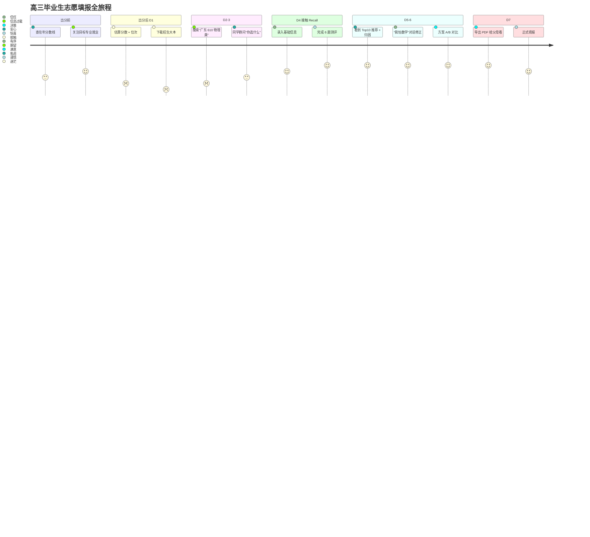

---

## 3. 业务核心逻辑

### 3.1 整体架构（产品视角）

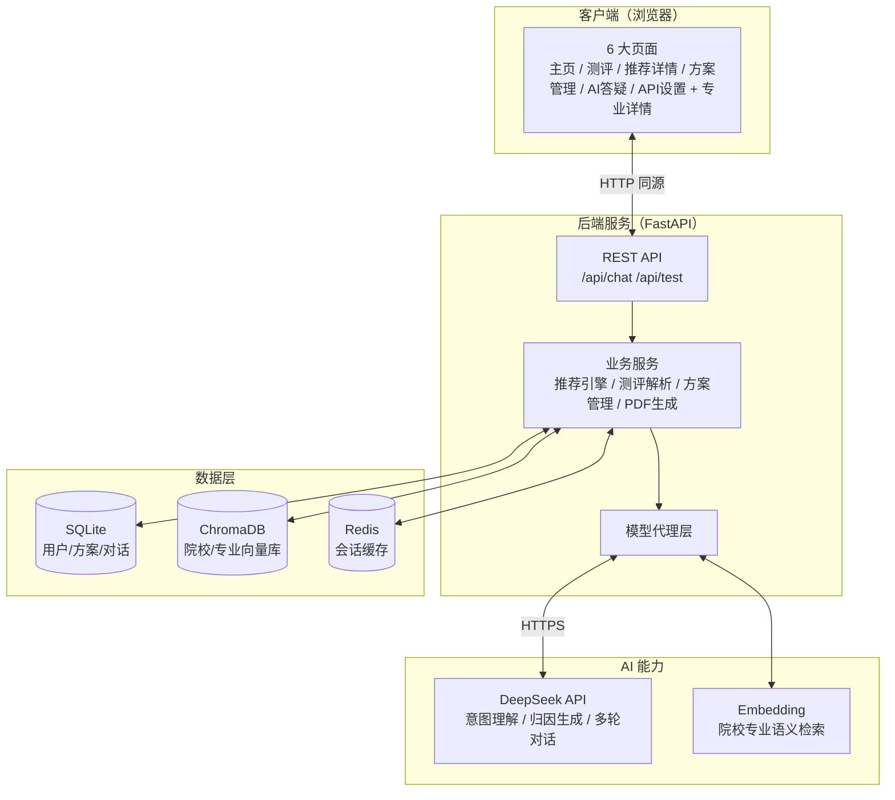

### 3.2 推荐引擎核心流程（多路召回 + 重排 + 归因）

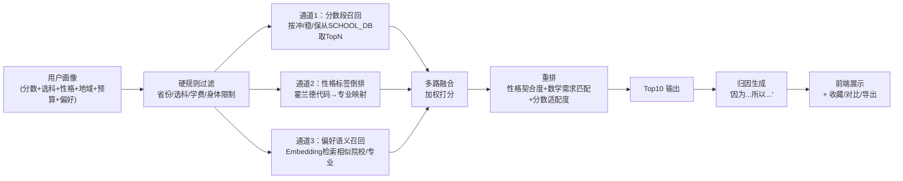

### 3.3 对话记忆系统（核心差异化）

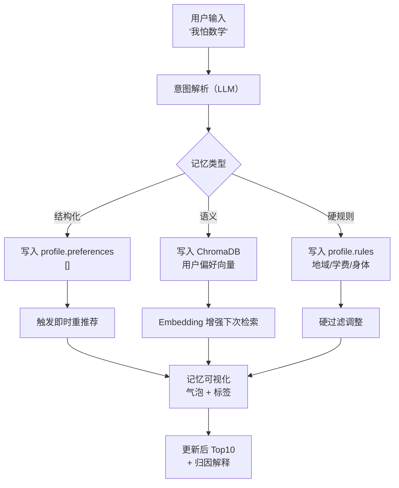

### 3.4 多版本方案管理

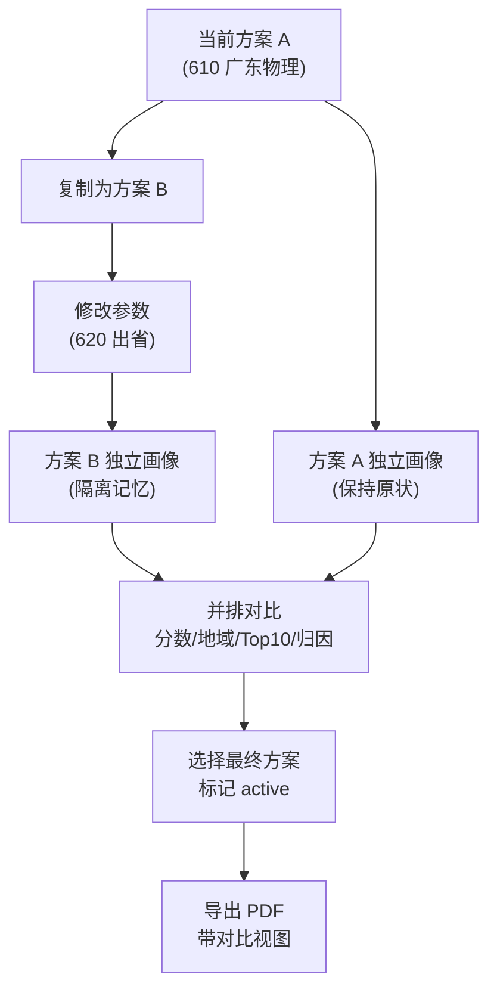

---

## 4. 功能流程描述

### 4.1 首次画像构建

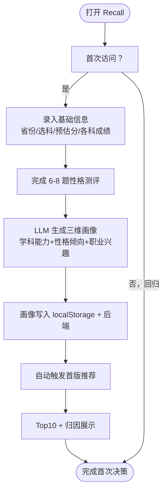

### 4.2 偏好修正与重推荐

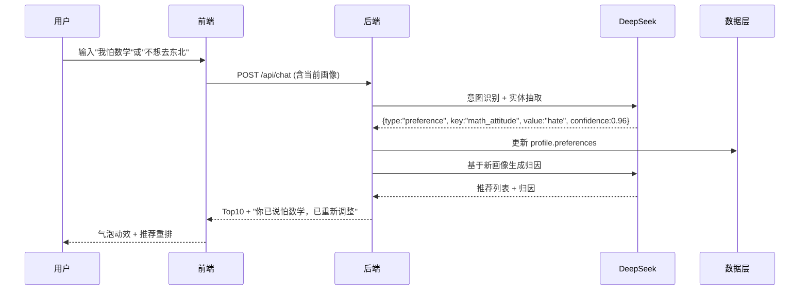

### 4.3 院校/专业查询

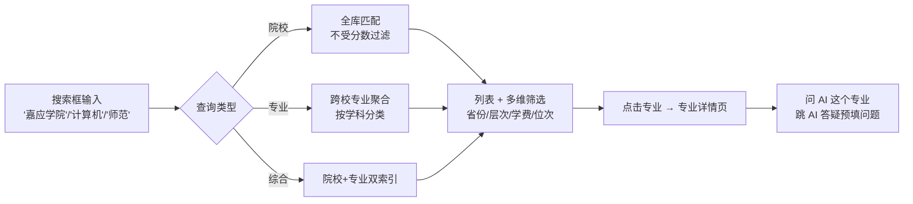

### 4.4 PDF 导出

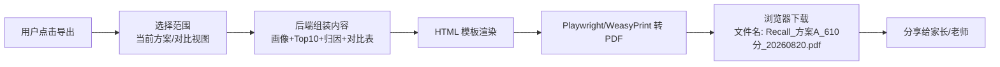

### 4.5 AI 答疑多轮对话

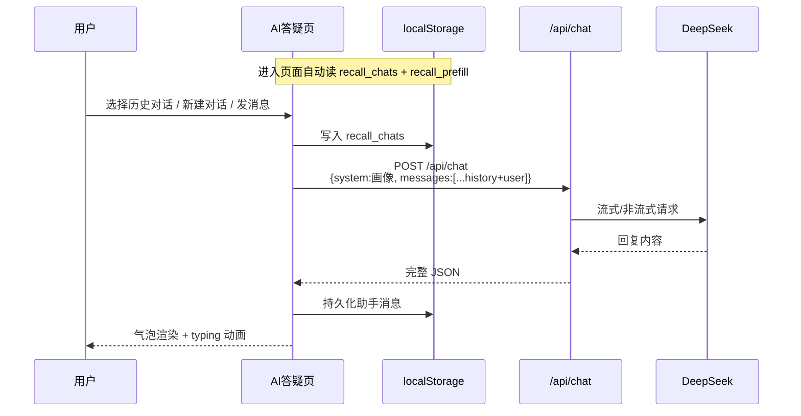

---

## 5. 功能需求详情

> 格式：每项含**用户故事 / 交互 / 数据 / 边界 / 优先级**五要素

### 5.1 基础信息录入（P0）

| 要素 | 描述 |
| --- | --- |
| 用户故事 | 作为考生，我希望在 3 分钟内完成基础信息录入，系统就能给出初始推荐 |
| 交互 | 表单：省份（下拉 31 省）/ 选科模式（3+1+2 / 3+3 自动按省份联动）/ 预估分（450-750 数字 + 滑块）/ 各科成绩（按选科动态渲染）/ 偏好（多选 chips） |
| 数据 | 写入 `recall_profile`（localStorage）+ `users.profile`（后端） |
| 边界 | 分数超范围 Toast 提示；选科与省份不匹配禁用提交 |
| 优先级 | P0，MVP 必上 |

### 5.2 性格测评（P0）

| 要素 | 描述 |
| --- | --- |
| 用户故事 | 作为考生，我希望用 2 分钟完成测评，看到自己属于什么类型 |
| 交互 | 6 步进度条；每步 3 题；五点量表圆点；结果页六维雷达图 + 前 2 名高亮 + 专业方向映射 + 关键词云 |
| 数据 | 写入 `recall_persona`（localStorage）+ `users.persona`（后端） |
| 边界 | 未答题禁止跳下一步；可中途返回上一步 |
| 优先级 | P0 |

### 5.3 智能推荐与归因（P0）

| 要素 | 描述 |
| --- | --- |
| 用户故事 | 作为考生，我希望看到 Top10 院校 + 每条"为什么是它"的解释 |
| 交互 | 主页：分数段提示条 → 推荐卡列表（冲/稳/保分组）→ 每卡含适配度条/归因白盒/收藏/对比/详情 |
| 数据 | 多路召回：分数段（SCHOOL_DB）+ 性格标签（Holland 映射）+ 偏好语义（Embedding）；归因由 LLM 生成 |
| 边界 | 0 结果：空状态引导降低分数或放宽地域 |
| 优先级 | P0 |

### 5.4 对话式偏好修改（P0）

| 要素 | 描述 |
| --- | --- |
| 用户故事 | 作为考生，我想用自然语言随时修改偏好 |
| 交互 | AI 答疑页：多轮对话；快捷问题胶囊；typing 动画；记忆写入气泡（橙色虚线 + 🧠） |
| 数据 | 结构化（`profile.preferences[]`）+ 语义（ChromaDB）+ 硬规则（`profile.rules[]`） |
| 边界 | 模糊表述请求澄清；冲突表述（如"想去北京又不想出省"）提示 |
| 优先级 | P0，**Recall 核心差异化** |

### 5.5 方案保存（P0）

| 要素 | 描述 |
| --- | --- |
| 用户故事 | 作为考生，我希望保存当前方案，下次打开还在 |
| 交互 | 自动保存（每次修改）/ 手动重命名 / 切换当前方案 / 复制为新方案 |
| 数据 | `recall_plans[]`（localStorage）+ `plans`（后端 SQLite） |
| 边界 | 同名提示；删除需二次确认 |
| 优先级 | P0 |

### 5.6 多版本模拟（P0）

| 要素 | 描述 |
| --- | --- |
| 用户故事 | 作为考生，我想试试"留省内 610"vs"出省 620"会怎样 |
| 交互 | 方案管理页：创建新版本弹窗（分数+地域校验）→ 独立计算 → 详情区显示该版本 Top5 |
| 数据 | 每个方案独立 `profile_snapshot`；记忆不互通 |
| 边界 | 分数超出当前选科录取段提示 |
| 优先级 | P0 |

### 5.7 版本对比（P1）

| 要素 | 描述 |
| --- | --- |
| 用户故事 | 我想看方案 A vs 方案 B 区别在哪 |
| 交互 | 双列对比：分数/地域/性格/Top10/归因/适配度，差异高亮 |
| 数据 | 实时 `getRecommendations(profileA/B)` 双轨计算 |
| 边界 | 仅 2 个方案对比；3+ 方案需选择 2 个 |
| 优先级 | P1 |

### 5.8 PDF 导出（P1）

| 要素 | 描述 |
| --- | --- |
| 用户故事 | 我想把方案给父母看，他们不会用 AI 工具 |
| 交互 | 一键导出 → 浏览器下载 PDF（带画像摘要 + Top10 + 归因 + 对比视图可选） |
| 数据 | 后端 `WeasyPrint` 渲染 HTML 模板 |
| 边界 | 单 PDF ≤ 5MB；超过 50 页警告 |
| 优先级 | P1 |

### 5.9 院校/专业查询（P1）

| 要素 | 描述 |
| --- | --- |
| 用户故事 | 我想查嘉应学院/韩山师范学院/搜"计算机"相关所有学校 |
| 交互 | 主页搜索框 → 实时全库匹配（不受分数过滤）→ 多维筛选（省份/层次/学费/位次）→ 点击专业跳专业详情 |
| 数据 | `SCHOOL_DB`（67 所广东本科 + 476 专业 + 全量数据可扩展） |
| 边界 | 0 结果：建议换关键词；空字符串不触发搜索 |
| 优先级 | P1 |

### 5.10 收藏与对比（P1）

| 要素 | 描述 |
| --- | --- |
| 用户故事 | 我想把几所学校放一起对比 |
| 交互 | 推荐卡/详情页 ♡ 收藏 → 收藏夹（最多 20）→ 选择 2-4 所对比 |
| 数据 | `recall_fav_schools[]` + `recall_fav_majors[]` |
| 边界 | 超过 20 个提示删除最早的 |
| 优先级 | P1 |

### 5.11 清除记忆（P2）

| 要素 | 描述 |
| --- | --- |
| 用户故事 | 我想重头来过 |
| 交互 | 设置页"清除所有数据"按钮 → 二次确认 → 清除 localStorage + 后端记录 |
| 数据 | 全量清空，不可恢复 |
| 边界 | 必须输入"确认清除"二次验证 |
| 优先级 | P2 |

### 5.12 帮助中心（P2）

| 要素 | 描述 |
| --- | --- |
| 用户故事 | 我卡住了想知道怎么用 |
| 交互 | 每页右下角悬浮帮助按钮 → 自定义浮层（无 alert）→ 文字 + 截图步骤 |
| 数据 | 静态帮助文案 |
| 边界 | 仅展示当前页相关帮助 |
| 优先级 | P2 |

### 5.13 专业详情页（P1）

| 要素 | 描述 |
| --- | --- |
| 用户故事 | 我想知道这个专业学什么、毕业干什么、要多少学费 |
| 交互 | 从主页/推荐详情/搜索结果点击专业 → `Recall_专业详情.html?school=&major=&score=` → 简介/核心课程 chips/就业前景评估条/学费分档/适配建议/"问 AI 这个专业" |
| 数据 | `LIB` 按 12 类（医/药/计算机/工/理/教/文/法/经管/艺/体/农）内置模板 |
| 边界 | 学费按公办/民办/合办 + 专业类自动判定 |
| 优先级 | P1 |

### 5.14 API 模型设置（P0 基础设施）

| 要素 | 描述 |
| --- | --- |
| 用户故事 | 我想用 DeepSeek/通义千问/硅基流动等不同模型 |
| 交互 | 预设 5 个模型 + 自定义；保存到 localStorage；测试连接（走后端代理）；后端状态自动探测 |
| 数据 | `recall_api_config` |
| 边界 | 真实 Key 不可填前端，仅保存占位；测试连接必须经后端避免暴露 |
| 优先级 | P0（基础设施，无此页 AI 全瘫） |

---

## 6. 非功能需求

### 6.1 性能

| 指标 | 要求 |
| --- | --- |
| API 响应时间（不含 AI） | P95 < 500ms |
| AI 流式首字延迟 | < 2s |
| 首屏加载 | < 2s（4G 网络 + 普通笔记本） |
| 冷启动 | 后端启动 < 5s |
| 并发 | ≥ 100 QPS（AI 通道限速外） |

### 6.2 安全

| 项 | 要求 |
| --- | --- |
| API Key | 仅存后端 `.env` + 环境变量；前端不可见不可传 |
| 用户数据 | SQLite 本地持久化 + 可选加密 |
| 输入校验 | FastAPI Pydantic 严格校验；前端 `escHtml` 防 XSS |
| CORS | MVP 全开，上线后收敛到前端域名 |
| 速率限制 | AI 通道按用户 ID 限速 60 req/min |

### 6.3 兼容性

- 浏览器：Chrome 100+ / Edge 100+ / Safari 15+ / Firefox 100+ 最新两个稳定版
- 设备：响应式设计，断点 860px
- 系统：Windows 10+ / macOS 12+ / iOS 15+ / Android 10+

### 6.4 可扩展性

- 院校数据库：当前 67 所（广东），需可扩展至全国 2900+ 所
- 测评维度：当前霍兰德六维，预留 MBTI / 大五人格扩展位
- 模型：当前 DeepSeek，预留多模型路由层

### 6.5 可观测性

- 后端结构化日志（请求路径/耗时/状态码/AI token 用量）
- 关键事件埋点：测评完成、首版推荐生成、偏好修改、PDF 导出、方案对比
- 错误监控：Sentry（前端）+ Sentry/自托管 Sentry（后端）

### 6.6 可用性

- 服务可用性 ≥ 99.5%
- 降级策略：AI 通道异常时降级为静态推荐
- 离线兜底：localStorage 完整方案可离线查看

---

## 7. 验收标准

### 7.1 功能验收（Given/When/Then）

| ID | 模块 | 用例 | 预期 |
| --- | --- | --- | --- |
| AC-01 | 基础信息 | Given 我是广东物理类考生 When 我填 610 分 + 物化生 | 主页自动推荐 7 冲 7 稳 53 保 |
| AC-02 | 测评 | Given 我完成 18 题 When 提交 | 6 维雷达图 + 前 2 名维度高亮 + 主页画像同步 |
| AC-03 | 推荐归因 | Given 我看到一条推荐 When 展开归因 | 至少含 1 条"因为...所以..."白盒解释 |
| AC-04 | 对话修正 | Given 我说"我怕数学" When AI 回复 | 主页"高数学需求"专业降权 + 记忆气泡出现 |
| AC-05 | 方案管理 | Given 我创建方案 B（620 出省）When 保存 | 方案 A 不变，B 独立计算 Top10 |
| AC-06 | 版本对比 | Given 我选方案 A + B When 对比 | 差异条目高亮，分数/地域/Top10 字段对齐 |
| AC-07 | PDF 导出 | Given 我点导出 When 下载 | PDF 含画像 + Top10 + 归因 + 时间戳 |
| AC-08 | 搜索 | Given 我搜"嘉应学院"When 列表显示 | 命中且无分数过滤拦截 |
| AC-09 | 收藏 | Given 我点 ♡ When 添加 | 收藏夹 +1，超过 20 提示 |
| AC-10 | 帮助 | Given 我点右下角帮助 When 弹出 | 当前页相关文案 + 点击外部关闭 |

### 7.2 非功能验收

| ID | 类别 | 标准 |
| --- | --- | --- |
| NF-01 | 性能 | Lighthouse Performance ≥ 85 |
| NF-02 | 可访问性 | Lighthouse Accessibility ≥ 90 |
| NF-03 | 兼容性 | 4 浏览器 × 3 断点均无功能性 bug |
| NF-04 | 安全 | OWASP Top 10 漏洞扫描 0 高危 |
| NF-05 | 鲁棒性 | 断网 30s 后页面不白屏，恢复后自动重试 |

### 7.3 验收流程

1. PM + 前端 + 后端 + 测试四方走查
2. 灰度 5% 流量 1 周
3. 全量发布

---

## 8. 技术方案概要

### 8.1 技术栈

| 层 | 选型 | 理由 |
| --- | --- | --- |
| 前端 | Vue 3 + Pinia + Vue Router + Vite | 组合式 API + 良好 TS 支持 + 生态丰富 |
| UI 组件 | Naive UI / 自研 | Recall 设计系统（马卡龙）需自研为主 |
| 后端 | FastAPI + Uvicorn | 异步高性能 + 自动 OpenAPI 文档 + Pydantic 校验 |
| 数据库 | SQLite（主） + 可扩展 PostgreSQL | MVP 单机部署足够，扩展平滑 |
| 向量库 | ChromaDB | 轻量 + 嵌入式 + 易扩展 |
| AI 模型 | DeepSeek API（主） | 性价比高 + 中文理解优秀 + 推理强 |
| Embedding | BGE-small-zh / OpenAI text-embedding-3-small | 中文场景适配 |
| PDF | WeasyPrint / Playwright | HTML→PDF 简单可控 |
| 部署 | Docker Compose（V1） → Kubernetes（V2） | MVP 单机，V2 弹性 |

### 8.2 模块划分

```
frontend/
  src/
    pages/
      Home.vue           # 主页
      Assessment.vue     # 性格测评
      RecommendDetail.vue # 推荐详情
      PlanManage.vue     # 方案管理
      AIChat.vue         # AI 答疑
      APISettings.vue    # API 设置
      MajorDetail.vue    # 专业详情
    components/          # 复用组件
    stores/              # Pinia
    services/            # API client
    styles/              # Recall 设计令牌

backend/
  app/
    api/                 # 路由
    services/
      recommender.py     # 推荐引擎
      persona.py         # 测评解析
      plan_manager.py    # 方案管理
      memory.py          # 对话记忆
      pdf_generator.py   # PDF 导出
    models/              # Pydantic Schema
    db/                  # SQLite ORM
    vector/              # ChromaDB
    llm/                 # 模型代理层
  main.py
  requirements.txt
  .env
```

### 8.3 数据模型（核心表）

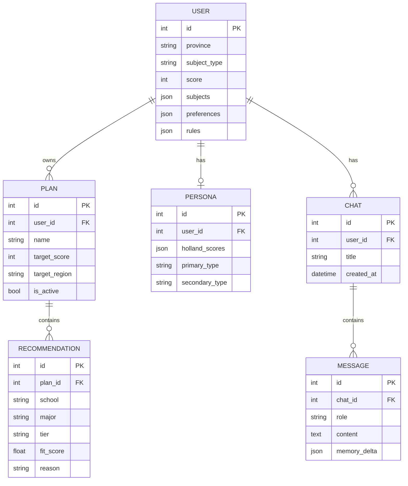

### 8.4 关键算法

| 算法 | 描述 | 复杂度 |
| --- | --- | --- |
| 多路召回 | 分数段召回 O(N) + 性格倒排 O(M) + 语义检索 O(log K) | < 100ms |
| 重排 | 加权打分 + 软规则 + 数学匹配 boost | O(10 log 10) |
| 归因生成 | LLM 单次 prompt，token ≤ 200 | < 2s |
| 记忆抽取 | LLM 结构化输出（JSON 模式） | < 1.5s |

### 8.5 部署架构

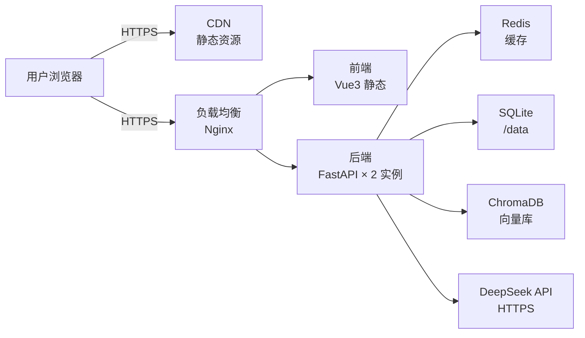

### 8.6 风险与对策

| 风险 | 影响 | 对策 |
| --- | --- | --- |
| DeepSeek API 限速/不可用 | 推荐/对话全瘫 | 多模型路由 + 静态推荐降级 |
| 用户数据丢失 | 信任崩塌 | localStorage + 后端双写 + 7 日快照 |
| AI 归因错误（幻觉） | 推荐失信 | 归因模板强约束 + 关键事实回查 |
| 数据库扩展瓶颈 | 性能下降 | 早期 PostgreSQL 替换 SQLite |
| 测评学术性受质疑 | 学校不推荐 | 提供"测评局限"声明 + 引导家长参与 |

---

## 附录 A：当前实现进度（MVP）

| 页面 | 状态 | 路径 |
| --- | --- | --- |
| 主页 | ✅ 完成 | `Recall_主页.html` |
| 性格测评 | ✅ 完成 | `Recall_测评.html` |
| 推荐详情 | ✅ 完成 | `Recall_推荐详情.html` |
| 方案管理 | ✅ 完成 | `Recall_方案管理.html` |
| AI 答疑 | ✅ 完成 | `Recall_AI答疑.html`（接真实 /api/chat） |
| API 设置 | ✅ 完成 | `Recall_API设置.html` |
| 专业详情 | ✅ 完成 | `Recall_专业详情.html` |
| 后端 | ✅ 完成 | `backend/main.py`（端口 8011） |
| 院校数据库 | ✅ 67 所广东本科 + 3268 专业（2025 真实数据占 73%） | `data/schools_*.json` |

## 附录 B：术语表

| 术语 | 解释 |
| --- | --- |
| 霍兰德代码 | RIASEC 六型人格（Realistic / Investigative / Artistic / Social / Enterprising / Conventional） |
| 位次 | 分数在全省同科类同卷考生中的排名 |
| 冲/稳/保 | 志愿填报策略：冲=录取概率较低的好学校；稳=概率较高；保=兜底 |
| 3+1+2 | 新高考选科模式：语数外 + 首选物理/历史 + 4 选 2 |
| 3+3 | 新高考模式：语数外 + 6 选 3 |
| 平行志愿 | 多志愿同时投档，按位次优先匹配 |
| 多路召回 | 推荐系统从多通道并行取候选再融合 |
| Embedding | 文本向量化，用于语义相似度检索 |
