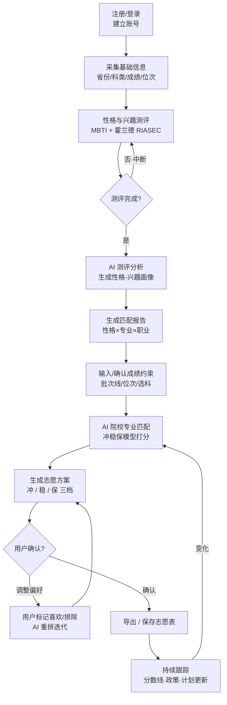

# 大学志愿填报 AI · 业务流程设计

> 产品定位：面向高三毕业生的 AI 志愿填报助手
> 核心价值：**分析学生性格 → 匹配喜欢且合适的专业 → 结合成绩生成冲稳保志愿方案**
> 角色图例：🔵 用户操作  🟣 AI 处理  ⚙️ 系统处理

---

## 一、核心业务流程（主流程）



---

## 二、主流程关键节点详述

| # | 节点 | 角色 | 触发条件 | 处理逻辑 | 输出结果 | 异常分支 |
|---|------|------|----------|----------|----------|----------|
| N1 | 注册/登录 | 🔵⚙️ | 用户首次打开产品 | 微信授权/手机号注册，建立用户账号与会话 | 用户账号 + 登录态 | 授权失败→引导重试；已注册→直接进入首页 |
| N2 | 基础信息采集 | 🔵⚙️ | 登录后进入新手引导 | 填写省份、科类（物化生等）、模考/预估成绩、位次、批次 | 结构化基础档案 | 必填缺失→拦截提示；成绩越界→前端校验报错 |
| N3 | 性格兴趣测评 | 🔵🟣 | 基础信息提交完成 | 推送测评题（MBTI 简化版 + 霍兰德 RIASEC），用户逐题作答 | 测评原始答案集 | 中途退出→草稿保存可续答；作答过快/一致性低→提示重测 |
| N4 | 测评分析 | 🟣 | 测评提交 | 计算性格类型与兴趣代码，生成六维雷达与置信度 | 性格-兴趣画像 JSON | 数据异常/样本不足→退回重测 |
| N5 | 匹配报告生成 | 🟣⚙️ | 画像生成 | 映射 性格→适配专业大类→典型职业→代表院校，按契合度排序 | 性格×专业×职业匹配报告（Top 专业推荐） | 映射为空→放宽阈值或提示补充兴趣标签 |
| N6 | 成绩约束输入 | 🔵⚙️ | 报告可查看后进入"选校" | 确认/修正成绩、位次、批次线、选科限制 | 约束参数包 | 位次缺失→用省排名模型估算并标注"估算" |
| N7 | 院校专业匹配 | 🟣⚙️ | 约束确认 | 结合位次、选科、性格偏好、历年录取线，构建冲稳保打分模型 | 候选院校专业列表（打分排序） | 无匹配→放宽条件/提示复交或降批次 |
| N8 | 志愿方案生成 | 🟣⚙️ | 候选列表就绪 | 按冲/稳/保三档生成志愿表，控制梯度与退档风险 | 志愿方案（冲稳保三档） | 保底不足→红色告警并建议增补 |
| N9 | 确认/调整 | 🔵🟣 | 方案展示 | 用户标记喜欢/排除，AI 据反馈重排并解释原因 | 迭代后志愿方案 | 用户超时无操作→自动存草稿 |
| N10 | 导出保存 | 🔵⚙️ | 用户点击确认 | 生成 PDF/表格，落库到云端并支持分享 | 志愿表文件 | 导出失败→重试 + 本地缓存兜底 |
| N11 | 持续跟踪 | ⚙️🟣 | 方案保存后 / 定时任务 | 监测分数线、招生政策、计划变动，触发重算与推送 | 变更提醒 + 方案更新建议 | 数据源不可用→暂停推送并站内提示 |

---

## 三、高频子流程

### 子流程 1：首次使用引导（Onboarding）

目标：降低认知门槛，让用户 3 分钟内拿到第一份"惊喜感"报告。

```mermaid
flowchart TD
    S1[欢迎页·价值说明] --> S2[授权手机号/微信]
    S2 --> S3[分步任务卡<br/>基础信息→测评→报告]
    S3 --> S4[实时进度激励<br/>完成度%]
    S4 --> S5[首份匹配报告揭晓]
    S5 --> S6[引导进入"选校"<br/>一键生成雏形方案]
    S6 --> S7[引导订阅日常复习]
```

| 步骤 | 角色 | 要点 |
|------|------|------|
| S1 欢迎页 | ⚙️ | 用 1 句话讲清"分析性格帮你选专业"，降低戒备 |
| S2 授权 | 🔵⚙️ | 静默注册，不强制填手机号（微信授权即可） |
| S3 任务卡 | 🔵⚙️ | 把 N2/N3 拆成小步，每步 < 1 分钟 |
| S4 进度激励 | ⚙️ | 进度条 + 文案激励，提升完成率 |
| S5 报告揭晓 | 🟣 | 先给"性格标签"再给"专业推荐"，制造惊喜 |
| S6 雏形方案 | 🟣⚙️ | 用预估分生成雏形，引导继续完善 |
| S7 订阅复习 | 🔵 | 引导开启日常复习，提升留存 |

---

### 子流程 2：日常复习

目标：在长填报周期（数月）内保持活跃，持续校准兴趣权重。

```mermaid
flowchart TD
    R1[定时/打开"复习"Tab] --> R2[系统推送今日卡片<br/>专业百科/院校动态/政策]
    R2 --> R3[用户学习+打卡/收藏]
    R3 --> R4[AI 记录掌握度与偏好信号]
    R4 --> R5[更新兴趣权重<br/>反哺推荐模型]
    R5 --> R6{权重变化显著?}
    R6 -->|是| R7[提示"你的偏好变了<br/>可重新生成方案"]
    R6 -->|否| R1
```

| 步骤 | 角色 | 触发条件 |
|------|------|----------|
| R1 | ⚙️🔵 | 每日定时（如早 8 点）或用户主动进入 |
| R2 | ⚙️🟣 | 基于用户已感兴趣的专业/院校生成卡片 |
| R3 | 🔵 | 用户浏览、收藏、答题反馈 |
| R4 | 🟣 | 每次交互后实时记录信号 |
| R5 | 🟣⚙️ | 周级聚合更新用户兴趣权重 |
| R6/R7 | 🟣 | 权重漂移超阈值→提示重算，形成召回 |

---

### 子流程 3：变式训练触发（方案变式推演）

目标：应对"模考分数波动 / 政策变动 / 用户假设推演"三类高频不确定性。

```mermaid
flowchart TD
    V0{触发源?}
    V0 -->|①模考成绩更新| V1
    V0 -->|②新政策/分数线| V1
    V0 -->|③用户主动 What-if| V1
    V1[复制当前方案为基准] --> V2[替换变量<br/>成绩/位次/政策参数]
    V2 --> V3[AI 重跑匹配模型]
    V3 --> V4[生成变式方案 A/B/C]
    V4 --> V5[对比视图<br/>录取概率/梯度/风险]
    V5 --> V6{差异显著?}
    V6 -->|是| V7[提示采纳/替换原方案]
    V6 -->|否| V8[提示"影响有限"·不扰动]
```

| 触发源 | 角色 | 处理逻辑 |
|--------|------|----------|
| ① 模考成绩更新 | 🔵⚙️ | 用户录入新模考分→自动比对原约束 |
| ② 新政策/分数线 | ⚙️🟣 | 爬虫/数据源更新→检测影响范围 |
| ③ 用户 What-if | 🔵 | 手动调"假设我高/低 20 分" |
| V4 变式方案 | 🟣⚙️ | 输出 2–3 套对照方案，标注概率变化 |
| V6/V7 | 🟣🔵 | 差异大→引导采纳；否则不打扰，避免焦虑 |

---

## 四、关键设计要点（PM 备注）

1. **性格是"过滤器"不是"决定器"**：性格匹配用于初筛专业大类与兴趣方向，最终方案必须叠加成绩/位次硬约束，避免"喜欢但够不着"的空方案。
2. **可信度透明**：AI 给出的每一档推荐都带"录取概率"与"依据"，减少黑箱感，符合高三家庭决策习惯。
3. **异常即留存机会**：测评中断存草稿、超时存方案草稿、变式无差异不打扰——所有异常分支都服务于"降低流失"。
4. **数据合规**：成绩、位次属敏感信息，默认本地加密 + 用户授权云端才上传，符合未成年人数据保护要求。
5. **变式训练是差异化卖点**：多数填报工具只给"一次性方案"，本产品用变式推演承接模考波动带来的反复决策，提升使用频次与付费转化。
