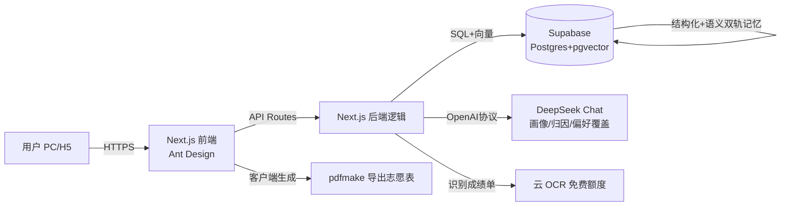

# 忆选 · 技术选型方案（个人开发者 · 低成本极速 MVP）

> 适用：1 人开发，预算极低，数周内出可演示 MVP，仅 Web 端（PC/移动 H5）。
> 选型三铁律：**学习成本低 · 开发效率高 · 成本可控（免费/极低价）**。
> 结论先行：**Next.js 全栈 + Supabase + DeepSeek** 一线到底，月成本 ≈ 0。

---

## 一、推荐技术栈总览

| 层 | 推荐（主推） | 备选 | 月成本 |
|----|------|------|------|
| 前端框架 | **Next.js (React + TS)** | Vue 3 + Vite | 0（Vercel/Cloudflare 免费） |
| UI 组件 | **Ant Design 5 + antd-mobile** | Naive UI / Element Plus | 0 |
| 后端 | **Next.js Route Handlers（同仓）** | FastAPI (Python) | 0 |
| 结构化 DB | **Supabase Postgres** | SQLite + 云盘 | 0（免费 500MB） |
| 向量库 | **Supabase pgvector** | Qdrant Cloud / Chroma | 0（同 Supabase） |
| 大模型 API | **DeepSeek Chat** | 智谱 GLM-4-Flash（免费额度） | ≈¥0–5 |
| OCR | **百度/腾讯云 OCR 免费额度** | PaddleOCR（本地免费） | 0 |
| PDF 生成 | **前端 pdfmake（客户端）** | WeasyPrint（后端） | 0 |
| 部署 | **Vercel / Cloudflare Pages** | Netlify / Render | 0（演示） |

> 一句话：一个语言（TS）打通前后端，一个 Supabase 账号包揽 DB+向量+存储+鉴权，一个大模型走通画像/归因/偏好覆盖。认知负担最小。

---

## 二、逐组件对比与推荐

### 2.1 前端框架
| 方案 | 学习成本 | 开发效率 | 说明 |
|------|------|------|------|
| **Next.js (React+TS)** ✅ | 中（需懂 React） | 高（全栈一体） | 一个仓库含前端+API，Vercel 一键部署，生态最大 |
| Vue 3 + Vite | 低（中文文档友好） | 高 | 上手最易，但前后端分离需多管一个服务 |
| 纯 HTML/JS | 最低 | 低 | 难做复杂状态（画像/多方案），不推荐做产品 |

**推荐 Next.js**：与你"数周出 MVP"最匹配——API 路由直接写后端，不用另起服务，部署免费。

### 2.2 后端框架
| 方案 | 学习成本 | 说明 |
|------|------|------|
| **Next.js Route Handlers** ✅ | 低（同语言） | MVP 够用，省一个服务 |
| FastAPI (Python) | 低（若你熟 Python） | AI/向量生态最成熟，但需单独部署 |
| Express/NestJS | 中 | 传统 Node 后端，需独立进程 |

**推荐 Next.js 内置 API**：MVP 阶段避免运维第二个服务。若后期 AI 逻辑变重，再拆 FastAPI（平滑迁移）。

### 2.3 数据库（结构化）
| 方案 | 成本 | 说明 |
|------|------|------|
| **Supabase Postgres** ✅ | 免费 500MB | 含 Auth/Storage/SQL 后台，pgvector 同库 |
| SQLite + 对象存储 | 0 | 最简但无托管后台，备份/并发自理 |
| 云 MySQL（阿里/腾讯） | 低~中 | 个人版有免费额度但需绑卡，略重 |

**推荐 Supabase**：一个账号同时拿到 DB、登录、文件存储、向量，独占"低成本+高效率"。

### 2.4 大模型 API
| 方案 | 价格 | 中文能力 | 说明 |
|------|------|------|------|
| **DeepSeek Chat** ✅ | ¥0.14/百万输入 | 强 | OpenAI 兼容，切换零成本，最省钱 |
| 智谱 GLM-4-Flash | 免费额度 | 强 | 备选/兜底，免费够 MVP |
| 通义千问 Qwen | 免费额度 | 强 | 备选 |
| GPT-4o / 文心 | 贵 | 中~强 | 超预算，不推荐 |

**推荐 DeepSeek**：中文好、便宜到可忽略，OpenAI 兼容协议让你随时换智谱/通义兜底。性格测评分析、归因逻辑链、自然语言偏好覆盖，全用它。

### 2.5 OCR（成绩单/截图识别）
| 方案 | 成本 | 说明 |
|------|------|------|
| **百度/腾讯云 OCR 免费额度** ✅ | 0（新用户额度） | 通用印刷体+表格，几行 API 调用 |
| PaddleOCR（本地） | 0 | 完全免费+隐私好，但需后端算力跑模型 |
| 飞浆/阿里云 OCR | 低 | 免费额度较小 |

**推荐云 OCR 免费额度**：MVP 最快；成绩属敏感数据，正式上线再切 PaddleOCR 本地化保隐私。

### 2.6 向量数据库（语义记忆）
| 方案 | 成本 | 说明 |
|------|------|------|
| **Supabase pgvector** ✅ | 0（同库） | 隐式偏好直接存 Postgres 向量列，免运维 |
| Qdrant Cloud | 免费 1GB | 独立向量库，需多接一个服务 |
| Chroma（嵌入式） | 0 | 本地/轻量，适合原型 |

**推荐 pgvector**：和结构化 DB 同一库，双轨记忆（JSON 硬约束 + 向量隐式偏好）一张表搞定，查询简单。

### 2.7 PDF 生成（志愿表导出）
| 方案 | 成本 | 说明 |
|------|------|------|
| **前端 pdfmake** ✅ | 0（客户端） | 浏览器直接生成，不耗服务器资源 |
| jsPDF + html2canvas | 0 | 适合把网页卡片转图再转 PDF |
| WeasyPrint（后端） | 0 | 排版美但占服务器，MVP 不必 |

**推荐 pdfmake 客户端生成**：导出零服务器成本，正好契合"成本可控"。

---

## 三、总体架构图

**双轨记忆落地**：`memory` 表一行 = 一个方案版本记忆空间
- `hard_constraints` JSON 列：分数、地域黑名单、选科（结构化）
- `implicit_prefs` vector 列：对话提取的隐式偏好嵌入（语义）
- `plan_id` 隔离多版本（方案A/B 各自独立）

---

## 四、MVP 落地路线图（数周）

| 周次 | 目标 | 关键动作 |
|------|------|------|
| W1 | 脚手架 + 数据层 | Next.js 初始化；Supabase 建表（users/plans/memory）；DeepSeek 接入 |
| W2 | 冷启动画像 | 基础信息表单 + 6-8 题测评；DeepSeek 生成"分数+性格"画像卡 |
| W3 | 推荐 + 归因 | 冲稳保推荐列表；每条附归因解释卡（白盒逻辑链） |
| W4 | 双轨记忆 + 微调 | 结构化硬约束编辑；语义偏好提取；自然语言覆盖（"怕数学"→重算） |
| W5 | 模拟方案 + 导出 | 复制方案改分（记忆隔离）；pdfmake 导出志愿表；OCR 接成绩单 |
| W6 | 打磨 + 演示 | 空状态引导、进度条、移动 H5 适配；部署 Vercel 出演示链接 |

---

## 五、成本估算（MVP 阶段）

| 项目 | 费用 |
|------|------|
| Vercel / Cloudflare Pages 部署 | ¥0 |
| Supabase Free | ¥0 |
| DeepSeek API（轻度演示） | ¥0–5/月 |
| 云 OCR 免费额度 | ¥0 |
| 域名（可选） | ¥0–60/年 |
| **合计** | **≈ ¥0–5 / 月** |

---

## 六、风险与降级

| 风险 | 降级方案 |
|------|------|
| DeepSeek 限流/不稳 | 切智谱 GLM-4-Flash 免费额度（同 OpenAI 协议，改 baseURL 即可） |
| Supabase 免费额度满 | 结构化数据迁 SQLite + 云盘；向量迁 Chroma 本地 |
| OCR 免费额度耗尽 | 改 PaddleOCR 本地免费，或让用户手动填分 |
| Vercel 商用限制 | 换 Cloudflare Pages / Netlify（免费且可商用） |
| 一人精力不够 | 先砍 OCR 与 PDF，保"测评→画像→归因推荐→偏好微调"主线 |

---

## 七、备选全栈 B（Python 偏好者）

若你更熟 Python，AI 生态更顺手：
- 前端 **Vue 3 + Element Plus**（学习成本最低，中文文档好）
- 后端 **FastAPI**（写 AI/向量最自然）
- 其余同上（Supabase + DeepSeek + 云 OCR + pdfmake）
- 部署：Render / Fly 免费层（后端）+ Vercel/Cloudflare（前端）

代价：多管一种语言 + 一个服务，认知负担略高，但 AI 编码最省心。
