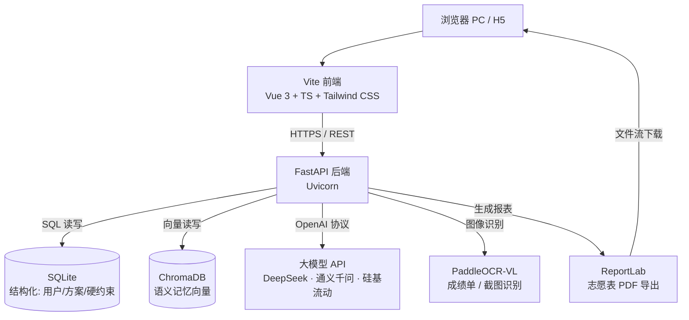
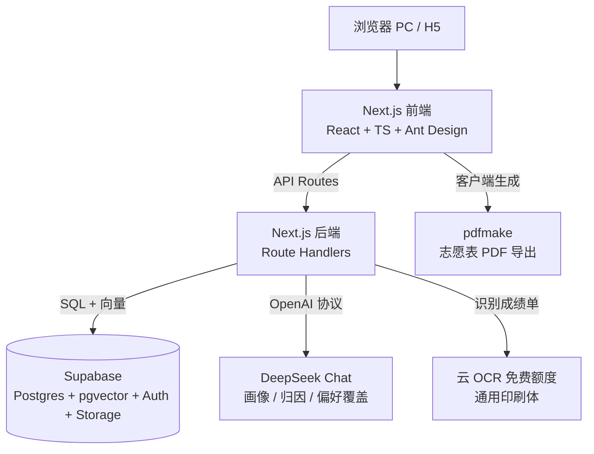
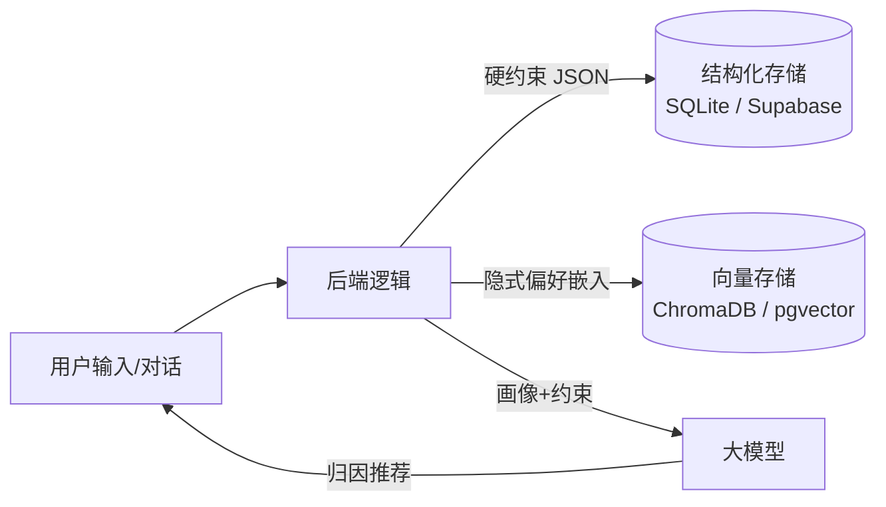

# 忆选 · 系统架构图（Mermaid）

> 含两版：① 你最终确定的技术栈；② 按我推荐方案镜像改写的版本。

---

## 一、你的技术栈（最终确定版）

浏览器 → Vite 前端 → FastAPI 后端 → SQLite / ChromaDB / 大模型 API / PaddleOCR-VL

**说明**
- 前端只和 FastAPI 打交道；所有持久化、AI、OCR、PDF 都在后端。
- SQLite 存结构化（用户/方案/硬约束 JSON），ChromaDB 存语义偏好向量，二者由 `plan_id` 隔离多版本。
- 大模型走 OpenAI 兼容协议，DeepSeek/通义千问/硅基流动可热切换。
- PaddleOCR-VL 本地跑，成绩敏感数据不出服务器，隐私好。
- ReportLab 后端生成 PDF，返回文件流给浏览器下载。

---

## 二、推荐方案镜像版（Next.js 全栈 + Supabase）

浏览器 → Next.js 前端 → Next.js 后端 → Supabase / DeepSeek API / 云 OCR

**与你栈的差异映射**

| 你的栈 | 推荐栈 | 变化点 |
|------|------|------|
| Vite + Vue3 | Next.js + React | 前端框架（推荐栈同仓含后端，少管一个服务） |
| FastAPI + Uvicorn | Next.js Route Handlers | 后端并入同仓，免独立进程 |
| SQLite | Supabase Postgres | 免费托管 + 自带 Auth/Storage 后台 |
| ChromaDB | Supabase pgvector | 向量与结构化同库，免运维第二个服务 |
| DeepSeek/通义/硅基流动 | DeepSeek Chat（同协议） | 一致，可热切换 |
| PaddleOCR-VL | 云 OCR 免费额度 | MVP 最快；上线再切本地保隐私 |
| ReportLab（后端） | pdfmake（前端） | 导出零服务器成本 |

> 推荐栈的核心诉求：一个语言（TS）打通前后端、一个 Supabase 账号包揽 DB+向量+存储+鉴权，月成本压到 ≈0。你选的栈更偏"Python 掌控力 + 本地隐私"，代价是多管前端/后端两个服务与 SQLite/ChromaDB 两个存储。

---

## 三、双轨记忆数据流向（两栈通用）

- 结构化：分数、地域黑名单、选科（确定性强，直接过滤）。
- 语义：对话提取的"怕数学""喜欢沿海"（向量检索，软匹配）。
- 多版本模拟：每个 `plan_id` 一份独立记忆空间，互不污染。
